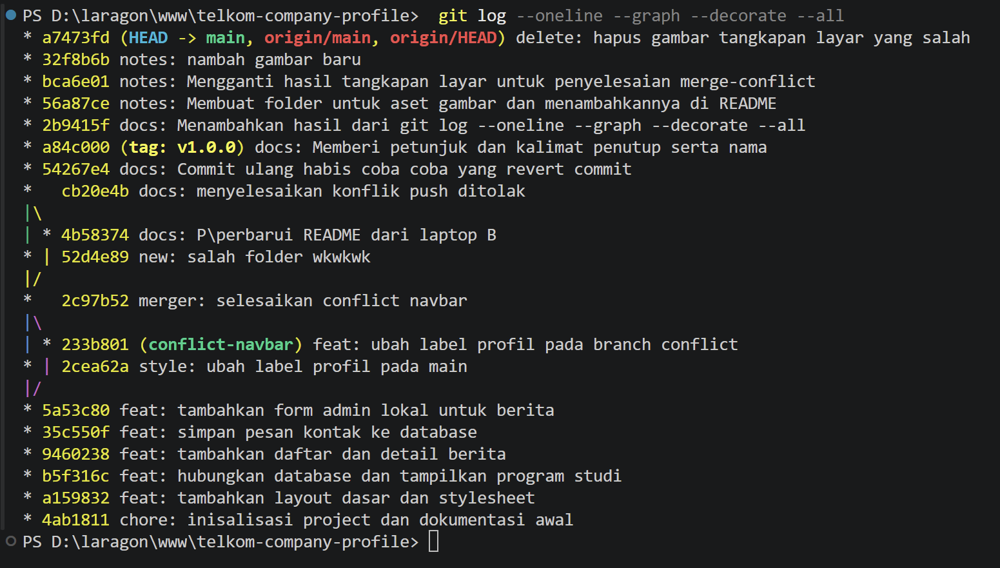
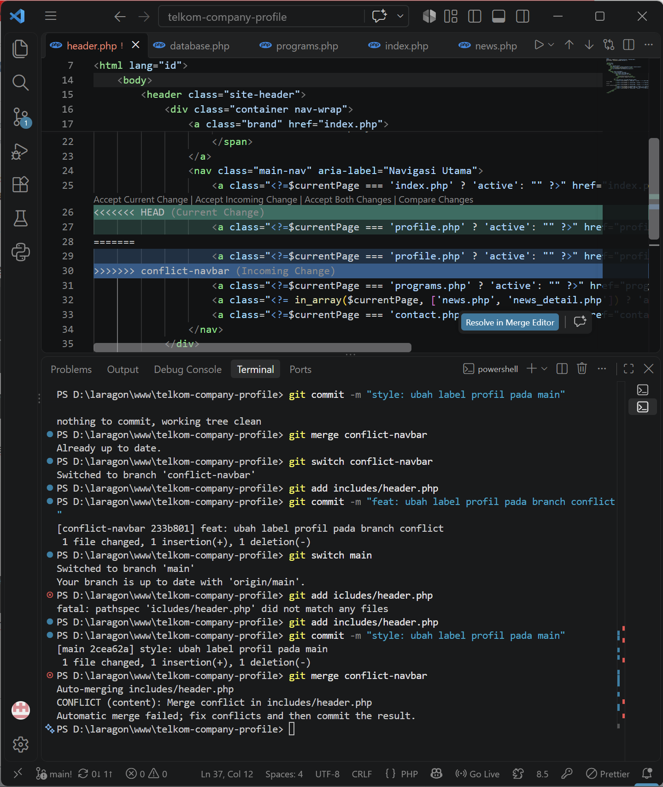
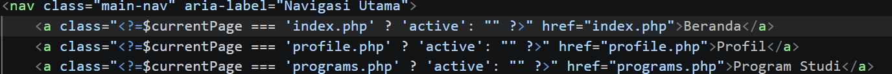

# Telkom University Company Profile - Praktikum  Project simulasi HTML, CSS, PHP native, MySQL/MariaDB, dan Git.

#Perubahan ini dibuat dari simulasi Laptop B

=====================================================
# Telkom University Company Profile - Praktikum Web

Website simulasi Company Profile Telkom University yang dibangun menggunakan **HTML, CSS, PHP Native, MySQL/MariaDB, dan Git** sebagai media pembelajaran praktikum pengembangan web dinamis dan *version control*.

---

## Fitur Utama

- **Beranda (`index.php`)**: Menampilkan *hero section*, ringkasan program studi, dan highlight berita terbaru secara dinamis.
- **Profil (`profile.php`)**: Menampilkan informasi umum proyek, visi pembelajaran, dan tujuan praktikum menggunakan komponen *header* & *footer* bersama.
- **Program Studi (`programs.php`)**: Menampilkan daftar program studi yang diambil langsung dari database MySQL.
- **Berita & Kegiatan (`news.php` & `news_detail.php`)**: Menampilkan daftar berita serta detail berita secara dinamis menggunakan *prepared statement* dan parameter URL (`GET`).
- **Form Kontak (`contact.php` & `contact_process.php`)**: Formulir untuk mengirim pesan ke database menggunakan *prepared statement* (`POST`).
- **Admin Lokal (`admin/add_news.php` & `admin/save_news.php`)**: Halaman simulasi untuk menambahkan berita baru ke database.

---

## Tech Stack & Prasyarat

- **Web Server & Database**: Laragon / XAMPP (Apache, PHP 8.x, MySQL / MariaDB)
- **Version Control**: Git & GitHub
- **Code Editor**: Visual Studio Code

# Hasil dari git log --oneline --graph --decorate --all
PS D:\laragon\www\telkom-company-profile>  git log --oneline --graph --decorate --all
* a7473fd (HEAD -> main, origin/main, origin/HEAD) delete: hapus gambar tangkapan layar yang salah
* 32f8b6b notes: nambah gambar baru
* bca6e01 notes: Mengganti hasil tangkapan layar untuk penyelesaian merge-conflict
* 56a87ce notes: Membuat folder untuk aset gambar dan menambahkannya di README
* 2b9415f docs: Menambahkan hasil dari git log --oneline --graph --decorate --all
* a84c000 (tag: v1.0.0) docs: Memberi petunjuk dan kalimat penutup serta nama
* 54267e4 docs: Commit ulang habis coba coba yang revert commit
*   cb20e4b docs: menyelesaikan konflik push ditolak
|\  
| * 4b58374 docs: P\perbarui README dari laptop B
* | 52d4e89 new: salah folder wkwkwk
|/  
*   2c97b52 merger: selesaikan conflict navbar
|\  
| * 233b801 (conflict-navbar) feat: ubah label profil pada branch conflict
* | 2cea62a style: ubah label profil pada main
|/  
* 5a53c80 feat: tambahkan form admin lokal untuk berita
* 35c550f feat: simpan pesan kontak ke database
* 9460238 feat: tambahkan daftar dan detail berita
* b5f316c feat: hubungkan database dan tampilkan program studi
* a159832 feat: tambahkan layout dasar dan stylesheet
* 4ab1811 chore: inisalisasi project dan dokumentasi awal

# Simulasi Merge Conflict
1. Pastikan status working tree bersih/clean
2. Buat branch conflict navbar, lalu pada branch tersebut ubah teks menu profil menjadi "Tentang Kami" pada     inludes/header.php. Kemudian commit perubahan
3. Kembali ke branch main, lakukan hal yang sama terhadap file includes/header.php pada baris profil, ubah menjadi "Tentang Kampus" lalu commit.
4. kemudian pake perintah git merge conflict-navbar untuk menggabungkan dengan branch main
5. Akan muncul sebuah marker seperti berikut:
Bagian antara <<<<<<< HEAD dan ======= berasal dari branch aktif. Bagian antara ======= dan >>>>>>> berasal dari branch yang sedang di-merge. Mahasiswa harus menentukan hasil final, lalu menghapus marker conflict.

# cara penyelesaiannya:
1. Pilih teks final, misal "profile" atau "profil"
2. Hapus seluruh marker <<<<<<<>>>>>>>
3. Ganti teks dengan teks final yang dipilih
4. Kemudian ketik git add includes/header.php
5. Lalu commit

Alhamdulillah selesai______~Dzaky Rafif Ariza(109062500122)

